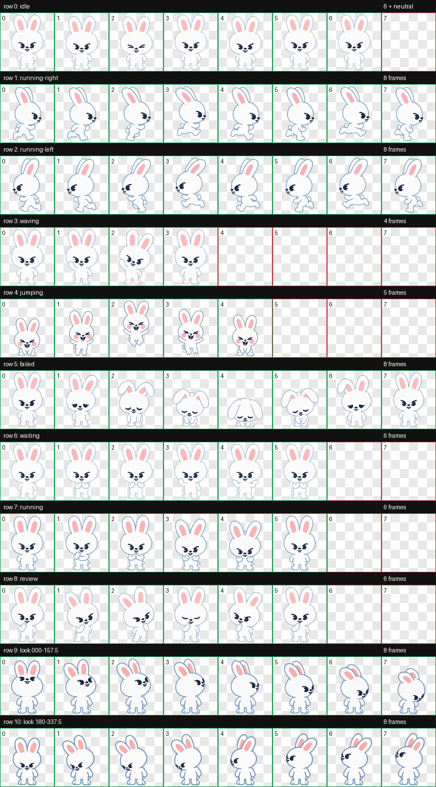

# Leebit for Codex

非官方 Leebit Codex 动画宠物（SKZOO / Stray Kids）。



## 功能

- Codex v2 宠物图集，尺寸为 `1536 × 2288`
- 9 组标准动画状态
- 16 个顺时针视线方向
- 开心露牙的跳跃动画
- 透明背景 WebP 精灵图

## 安装方法

### 方法一：使用安装脚本（macOS / Linux）

```bash
git clone https://github.com/TeressaC/Pet-Leebit-for-Codex.git
cd Pet-Leebit-for-Codex
./install.sh
```

安装完成后，重新打开 Codex，然后在宠物选择器中选择 **Leebit**。

### 方法二：手动安装

1. 下载本仓库中的 `pet.json` 和 `spritesheet.webp`。
2. 创建下面的文件夹（如果它还不存在）：

   ```text
   ~/.codex/pets/leebit/
   ```

3. 把 `pet.json` 和 `spritesheet.webp` 放进该文件夹。
4. 重新打开 Codex。
5. 在宠物选择器中选择 **Leebit**。

安装后的目录结构应为：

```text
~/.codex/pets/leebit/
├── pet.json
└── spritesheet.webp
```

## 文件说明

- `pet.json`：Codex 宠物资料，使用 `spriteVersionNumber: 2`
- `spritesheet.webp`：完整的 8 × 11 动画图集
- `preview/contact-sheet.png`：全部动画格预览
- `preview/look-directions.png`：默认姿势与 16 个视线方向
- `preview/jumping.gif`：开心跳跃动画预览
- `install.sh`：macOS / Linux 自动安装脚本

## 使用与版权说明

这是非官方同人作品，与 Stray Kids、JYP Entertainment、SKZOO 或相关权利人没有隶属、合作、授权或认可关系。Leebit、SKZOO、Stray Kids 及相关标识的权利归各自权利人所有。

仓库内的角色美术仅供个人、非商业的同人用途。公开转载、再发布或其他使用前，请自行确认并遵守相关权利人的规定。

本仓库的安装脚本、文件结构和 Codex 配置格式可以作为制作原创宠物的参考；这不代表授予任何 Leebit 角色或美术素材的权利。

**Pet package creator: Teressa Copple**

> “Creator” refers to the person who created and assembled this Codex animated pet package. Leebit, SKZOO, Stray Kids, and all related character and brand rights remain the property of their respective rights holders.
